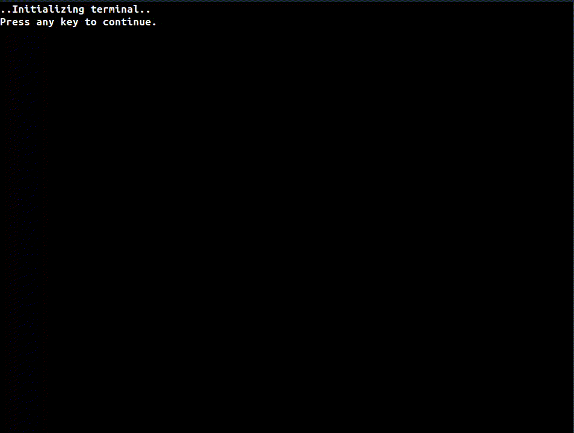

# Fallout Terminal


Fallout Terminal written in C.
## Project Tree:
```
.
├── include
│   ├── terminal.h
│   └── ui.h
├── makefile
├── README.md
└── src
    ├── main.c
    ├── terminal.c
    └── ui.c
```
## Installation
First clone this repository:
```console
git clone https://github.com/alkuzin/FalloutTerminal.git
```
Then:
```console
make && make clean
```
To run terminal run this command:
```console
clear && ./terminal
```
