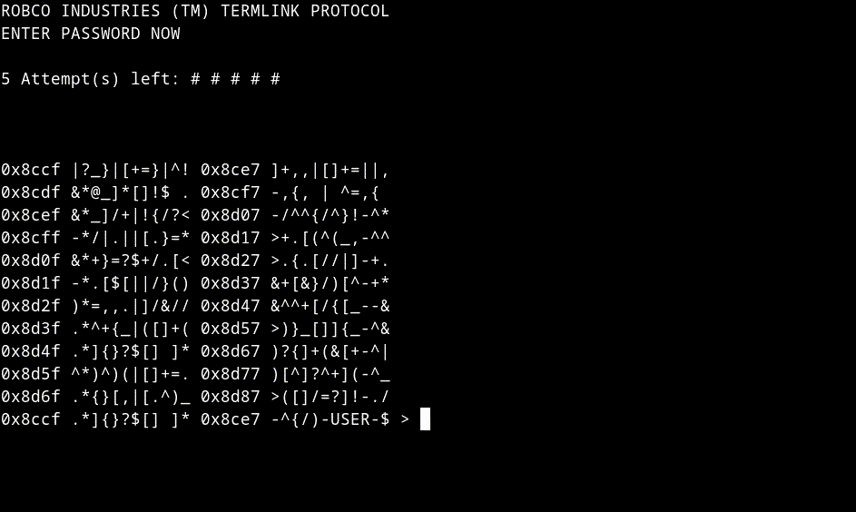

# Fallout Terminal

Fallout Terminal library written in C. 

(Fallout 4 terminal contents [here](https://fallout-archive.fandom.com/wiki/Fallout_4_terminals)).

> [!WARNING]
> Project is still under development. Some bugs can occur.

## Failed login


## Success login

<br>


## Controls
Press **[ tab ]** to return to previous window.

Press **[ q ]** to exit.

Press double **[ tab ]** to return to previous window from suboption.

## Installation
First clone this repository:
```console
git clone https://github.com/alkuzin/FalloutTerminal.git
```
Then move to *FalloutTerminal/* directory and run:
```console
make all && make clean
```
To see how this library works compile *libfterm.a* with *main.c*:
```console
gcc main.c libfterm.a -o terminal
```
And run this command:
```console
clear && ./terminal
```
## Issues
> [!WARNING]
> If your cursor disappeared run this command:
```console
printf "\e[?25h"
```
