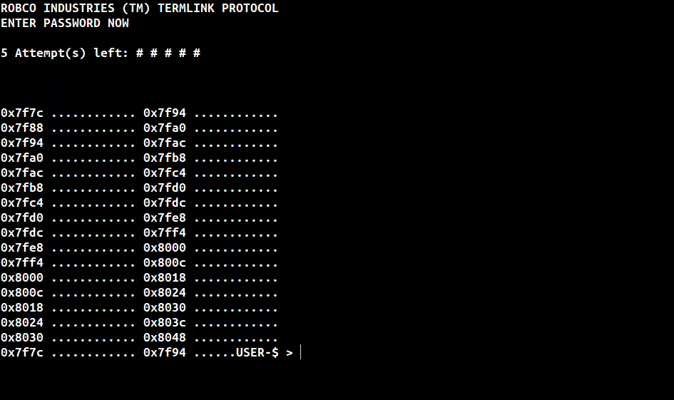
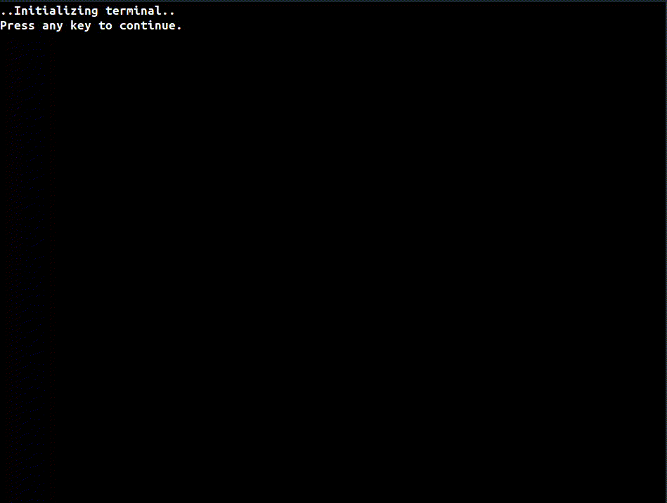

# Fallout Terminal

Fallout Terminal written in C.

> [!WARNING]
> Project is still under development. Some bugs can occur.

## Failed login


## Success login

<br>


## Project Tree:
```
├── include
│   ├── login.h
│   ├── terminal.h
│   └── ui.h
├── LICENSE
├── Makefile
├── README.md
├── src
│   ├── login.c
│   ├── main.c
│   ├── terminal.c
│   └── ui.c

```
## Controls
Press **[ tab ]** to return to previous window.

Press **[ q ]** to exit.

Press double **[ tab ]** to return to previous window from suboption.

## Installation
First clone this repository:
```console
git clone https://github.com/alkuzin/FalloutTerminal.git
```
Then:
```console
make && make clean
```
To run terminal run this command:
```console
clear && ./terminal
```
## Issues
> [!WARNING]
> If your cursor disappeared run this command:
```console
printf "\e[?25h"
```
